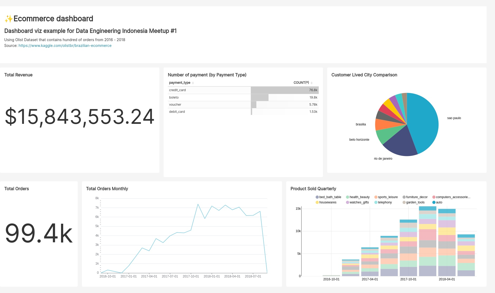

# Data Analysis with SQL

## Mindmap
To get the overview what we will discuss on this topic, we create a Mindmap that you might check here: [SQL Mindmap](https://www.mindomo.com/mindmap/sql-a037cdee98af462aad9c9210aef0194b)

## Slides
[Data Analysis with SQL](https://github.com/data-engineers-id/dei-meetups/Intro%20to%20Data%20Engineering/Data%20Analysis%20with%20SQL/Meetup.pdf)

## SQL Demo
Our SQL Learning is using data provided by [Mode](https://mode.com/sql-tutorial/) so please kindly check there.
And the queries that presented on the meetup is stored in [here](intro-sql.sql) 

## Viz Demo
We used [Apache Superset](https://superset.apache.org/) to present the Dashboard - pssst, they are Open Source by the way! You could also contribute to their [repo](https://github.com/apache/superset)

